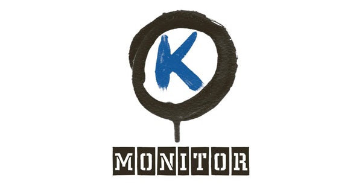

# Analysing Hungarian Procurements
This project is being conducted by
[K-Monitor](https://k-monitor.hu/fooldal)
and [tenders.guru]((https://tenders.guru/)).

 

## Data source
+ A snapshot of [Red Flags](https://www.redflags.eu/
+ A snapshot of [tenders.guru](https://tenders.guru/)

## External resources
+ The shortDescription filed was processed with
[magyarlanc](https://rgai.inf.u-szeged.hu/magyarlanc) [deprecated line]
+ The data was vectorized by [huBERT](https://hlt.bme.hu/en/resources/hubert)

## Using the SQL snapshot
+ We are using the `docker-compose` file in [this project](https://github.com/crow-intelligence/learnsql)
+ Fire up the docker-compose
+ Copy the unzipped sql snapshot to the attached volume `docker cp epf.sql learnsql_mariadb_1:/var/lib/mysql/`
+ Get the bash of the mariadb container `docker exec -it learnsql_mariadb_1 /bin/bash`
+ Run mysql `mysql -u root -p`
+ Create a database `MariaDB [(none)]> CREATE DATABASE kmonitor;`
+ Quit mysql (CTR+C/D usually works)
+ `cd var/lib/mysql/`
+ Now you can run the script which will populate
  your database with tables & data `mysql -u root -p kmonitor < epf.sql`
+ You can access [phpMyAdmin](http://0.0.0.0:8000/) at http://0.0.0.0:8000/
+ You'll see something like this 

## Team
+ [Zoltan Varju](https://github.com/zolizoli)

## MIT License
Copyright 2020 [K-Monitor](https://k-monitor.hu/fooldal)

Permission is hereby granted, free of charge, to any person obtaining a copy of this software and associated documentation files (the "Software"), to deal in the Software without restriction, including without limitation the rights to use, copy, modify, merge, publish, distribute, sublicense, and/or sell copies of the Software, and to permit persons to whom the Software is furnished to do so, subject to the following conditions:

The above copyright notice and this permission notice shall be included in all copies or substantial portions of the Software.

THE SOFTWARE IS PROVIDED "AS IS", WITHOUT WARRANTY OF ANY KIND, EXPRESS OR IMPLIED, INCLUDING BUT NOT LIMITED TO THE WARRANTIES OF MERCHANTABILITY, FITNESS FOR A PARTICULAR PURPOSE AND NONINFRINGEMENT. IN NO EVENT SHALL THE AUTHORS OR COPYRIGHT HOLDERS BE LIABLE FOR ANY CLAIM, DAMAGES OR OTHER LIABILITY, WHETHER IN AN ACTION OF CONTRACT, TORT OR OTHERWISE, ARISING FROM, OUT OF OR IN CONNECTION WITH THE SOFTWARE OR THE USE OR OTHER DEALINGS IN THE SOFTWARE.